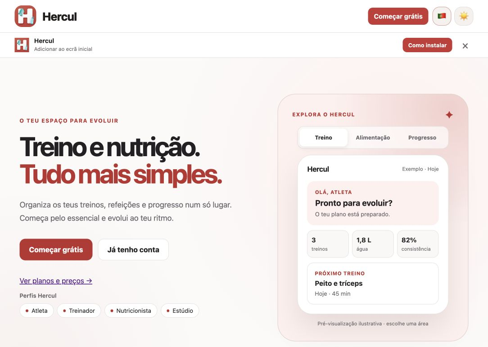
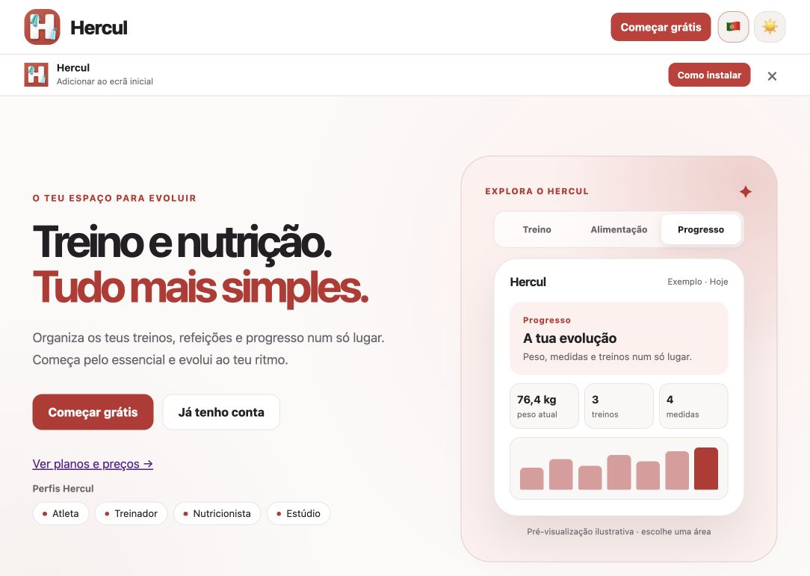
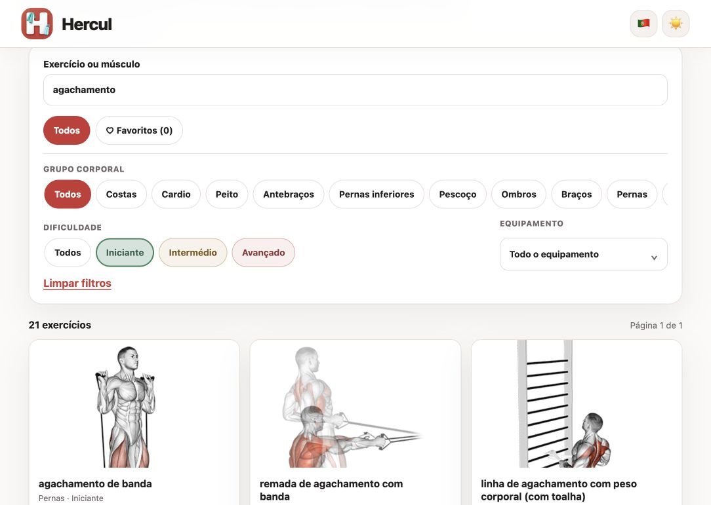

# Hercul V2 — visual walkthrough

Captured from the existing local development application on 6 October 2026. These are screenshots of the Angular interface, not generated mockups. The local working copy contained changes, so the images represent a development preview rather than a tagged release.

No account was created or used. The walkthrough stayed on guest-accessible screens and the application's explicitly illustrative preview. Application source remains private.

## 1. Entry screen

The guest home screen explains the product and provides routes to registration, login and the exercise catalogue. The panel on the right is labelled as an illustrative preview; its figures are example content, not personal records or measured outcomes.

## 2. Interactive preview

Selecting **Progresso** changed the selected tab and displayed the progress preview. This demonstrates the guest preview interaction; it does not establish that authenticated progress tracking has been tested.

## 3. Catalogue search and filtering

The guest exercise catalogue loaded. Entering **agachamento** and selecting **Iniciante** returned 21 exercises in the local build. The screenshot shows the active search, difficulty filter and results. This count describes that specific query in this development build, not a quality or performance metric.

## What was checked

| Interaction | Observed result |
| --- | --- |
| Open guest home | Product introduction and illustrative panel rendered |
| Select progress preview | Selection and panel content changed |
| Follow catalogue link | Exercise catalogue loaded |
| Combine search and difficulty | Query and selected difficulty produced matching results |

This is a focused UI check. It does not validate login, persistence, private account flows, the backend test suite, accessibility conformance, security or production readiness.

For an inspectable Java example, see the [training-session domain sample](https://github.com/bruno1251985/bruno1251985/blob/main/samples/training-session/README.md). That standalone example was prepared separately for the portfolio and is not the backend used by these screens.

[Hercul V2 engineering case study](CASE_STUDIES.md#hercul-v2) · [Return to profile](https://github.com/bruno1251985)
